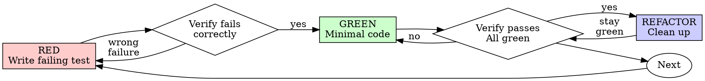

# Test-Driven Development (TDD)

- **Agents:** builder

## Overview

Write the test first. Watch it fail. Write minimal code to pass.

**Core principle:** If you didn't watch the test fail, you don't know if it tests the right thing.

## When to Use

**Always:**
- New features
- Bug fixes
- Refactoring
- Behavior changes

**Exceptions (ask the team lead):**
- Throwaway prototypes
- Generated code
- Configuration files

Thinking "skip TDD just this once"? Stop. That's rationalization.

## The Iron Law

```
NO PRODUCTION CODE WITHOUT A FAILING TEST FIRST
```

Write code before the test? Delete it. Start over.

**No exceptions:**
- Don't keep it as "reference"
- Don't "adapt" it while writing tests
- Don't look at it
- Delete means delete

Implement fresh from tests. Period.

## Red-Green-Refactor



### RED - Write Failing Test

Write one minimal test showing what should happen.

<Good>
```typescript
test('retries failed operations 3 times', async () => {
  let attempts = 0;
  const operation = () => {
    attempts++;
    if (attempts < 3) throw new Error('fail');
    return 'success';
  };

  const result = await retryOperation(operation);

  expect(result).toBe('success');
  expect(attempts).toBe(3);
});
```
Clear name, tests real behavior, one thing
</Good>

<Bad>
```typescript
test('retry works', async () => {
  const mock = jest.fn()
    .mockRejectedValueOnce(new Error())
    .mockRejectedValueOnce(new Error())
    .mockResolvedValueOnce('success');
  await retryOperation(mock);
  expect(mock).toHaveBeenCalledTimes(3);
});
```
Vague name, tests mock not code
</Bad>

**Requirements:**
- One behavior
- Clear name
- Real code (no mocks unless unavoidable)

### Verify RED - Watch It Fail

**MANDATORY. Never skip.**

```bash
npm test path/to/test.test.ts
```

Confirm:
- Test fails (not errors)
- Failure message is expected
- Fails because feature missing (not typos)

**Test passes?** You're testing existing behavior. Fix test.

**Test errors?** Fix error, re-run until it fails correctly.

### GREEN - Minimal Code

Write simplest code to pass the test.

<Good>
```typescript
async function retryOperation<T>(fn: () => Promise<T>): Promise<T> {
  for (let i = 0; i < 3; i++) {
    try {
      return await fn();
    } catch (e) {
      if (i === 2) throw e;
    }
  }
  throw new Error('unreachable');
}
```
Just enough to pass
</Good>

<Bad>
```typescript
async function retryOperation<T>(
  fn: () => Promise<T>,
  options?: {
    maxRetries?: number;
    backoff?: 'linear' | 'exponential';
    onRetry?: (attempt: number) => void;
  }
): Promise<T> {
  // YAGNI
}
```
Over-engineered
</Bad>

Don't add features, refactor other code, or "improve" beyond the test.

### Verify GREEN - Watch It Pass

**MANDATORY.**

```bash
npm test path/to/test.test.ts
```

Confirm:
- Test passes
- Other tests still pass
- Output pristine (no errors, warnings)

**Test fails?** Fix code, not test.

**Other tests fail?** Fix now.

### REFACTOR - Clean Up

After green only:
- Remove duplication
- Improve names
- Extract helpers

Keep tests green. Don't add behavior.

### Repeat

Next failing test for next feature.

### Version Control Discipline

**Commit on green, revert on red.** Every TDD cycle ends with a version control action.

| State | Action | Why |
|-------|--------|-----|
| GREEN (all tests pass) | `git commit` immediately | Creates a rollback save point. Do not batch commits across cycles. |
| RED persists after implementation | Revert implementation files, keep the test, retry | Prevents broken code from persisting in context. The test is the spec; the implementation is disposable. |
| REFACTOR breaks tests | Revert the refactor, try a smaller step | Refactoring must be behavior-preserving. If tests break, the refactor changed behavior. |

**Rules:**
- One commit per GREEN cycle. Never batch multiple behaviors into one commit.
- Revert means `git checkout -- <implementation-files>`, NOT `git reset --hard`.
- The test file is never reverted — it is the source of truth.
- If you have uncommitted changes from a previous cycle, commit or revert before starting a new RED phase.

### One-Behavior Rule

Each TDD cycle tests and implements exactly ONE behavior.

```
ONE test → ONE behavior → ONE implementation → ONE commit
```

**Good step sizes:**
- "User can log in with valid credentials"
- "Empty email returns validation error"
- "Retry operation after transient failure"

**Bad step sizes (too large):**
- "User authentication system" (multiple behaviors)
- "Form validation" (many rules in one step)
- "API endpoint with error handling and caching" (three behaviors)

**Why this matters for AI workflows:**
- **Error containment**: If AI generates a defect, it affects one behavior, not five.
- **Context window hygiene**: Smaller diffs keep the context focused. Large AI-generated blocks degrade subsequent generation quality.
- **Rollback granularity**: Reverting one behavior is surgical. Reverting five is expensive.
- **Review quality**: Small diffs are reviewable. Large AI-generated diffs get rubber-stamped.

If a test name contains "and", the step is too large. Split it.

### Test-Driven Generation (TDG)

TDG extends TDD for human-AI collaboration. Same Red-Green-Refactor cycle, different roles:

| Phase | Traditional TDD | Test-Driven Generation |
|-------|----------------|----------------------|
| RED | Developer writes test | Human writes test |
| GREEN | Developer writes implementation | AI generates implementation |
| REFACTOR | Developer cleans up | Human reviews, AI refactors |
| VERIFY | Developer runs tests | Human reads generated code AND runs tests |

**Key differences from pure TDD:**
- **Smaller steps**: AI benefits from tighter constraints. One behavior per cycle, no exceptions.
- **Mandatory version control**: Commit after every GREEN. AI-generated code without a passing test is untrusted.
- **Read before committing**: Never commit AI-generated code without reading it. `git diff` before `git commit`.
- **Test is the contract**: The human-written test is the specification. AI is a tool for generating implementations that satisfy it.

**The key insight:** Being effective with AI coding assistants requires being effective without them. TDG works because TDD works — the AI accelerates implementation, not design.

## Good Tests

| Quality | Good | Bad |
|---------|------|-----|
| **Minimal** | One thing. "and" in name? Split it. | `test('validates email and domain and whitespace')` |
| **Clear** | Name describes behavior | `test('test1')` |
| **Shows intent** | Demonstrates desired API | Obscures what code should do |

## Red Flags - STOP and Start Over

- Code before test
- Test after implementation
- Test passes immediately
- Can't explain why test failed
- Tests added "later"
- Rationalizing "just this once"
- "I already manually tested it"
- "Tests after achieve the same purpose"
- "It's about spirit not ritual"
- "Keep as reference" or "adapt existing code"
- "Already spent X hours, deleting is wasteful"
- "TDD is dogmatic, I'm being pragmatic"
- "This is different because..."

**All of these mean: Delete code. Start over with TDD.**

## Example: Bug Fix

**Bug:** Empty email accepted

**RED**
```typescript
test('rejects empty email', async () => {
  const result = await submitForm({ email: '' });
  expect(result.error).toBe('Email required');
});
```

**Verify RED**
```bash
$ npm test
FAIL: expected 'Email required', got undefined
```

**GREEN**
```typescript
function submitForm(data: FormData) {
  if (!data.email?.trim()) {
    return { error: 'Email required' };
  }
  // ...
}
```

**Verify GREEN**
```bash
$ npm test
PASS
```

**REFACTOR**
Extract validation for multiple fields if needed.

## Verification Checklist

Before marking work complete:

- [ ] Every new function/method has a test
- [ ] Watched each test fail before implementing
- [ ] Each test failed for expected reason (feature missing, not typo)
- [ ] Wrote minimal code to pass each test
- [ ] All tests pass
- [ ] Output pristine (no errors, warnings)
- [ ] Tests use real code (mocks only if unavoidable)
- [ ] Edge cases and errors covered

Can't check all boxes? You skipped TDD. Start over.

## When Stuck

| Problem | Solution |
|---------|----------|
| Don't know how to test | Write wished-for API. Write assertion first. Ask the team lead. |
| Test too complicated | Design too complicated. Simplify interface. |
| Must mock everything | Code too coupled. Use dependency injection. |
| Test setup huge | Extract helpers. Still complex? Simplify design. |

## Debugging Integration

Bug found? Write failing test reproducing it. Follow TDD cycle. Test proves fix and prevents regression.

Never fix bugs without a test.

## Testing Anti-Patterns

When adding mocks or test utilities, read testing-anti-patterns.md to avoid common pitfalls:
- Testing mock behavior instead of real behavior
- Adding test-only methods to production classes
- Mocking without understanding dependencies

## Related Skills

- `verification-before-completion` — For non-code verification (documentation, claims, config)
- `systematic-debugging` — For failure investigation when tests fail unexpectedly

## Final Rule

```
Production code → test exists and failed first
Otherwise → not TDD
```

No exceptions without the team lead's approval.

## Supporting Files

- `supporting-files/testing-anti-patterns.md` — Common testing anti-patterns to avoid
- `supporting-files/ai-code-quality-benchmarks.md` — AI code defect rates, security failure rates, and review burden metrics for calibration

